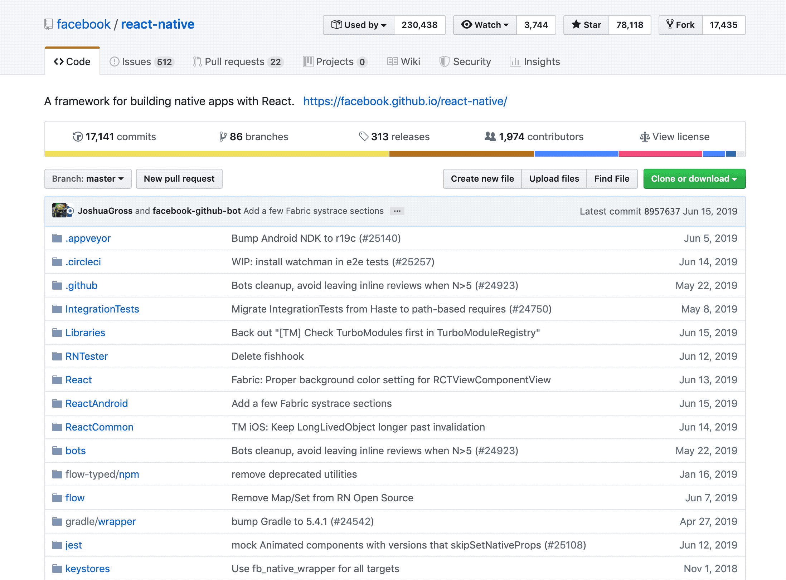
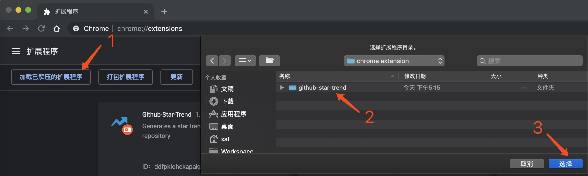
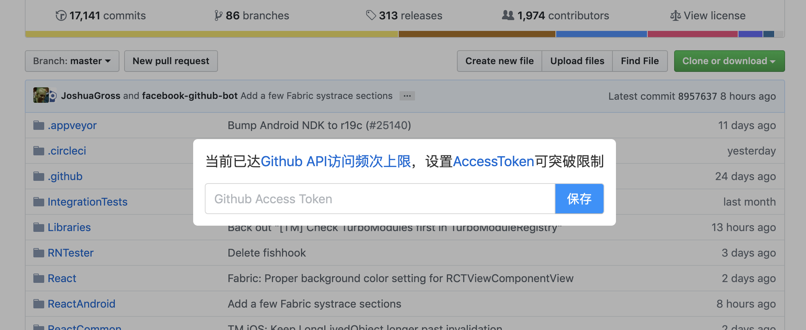

# github-star-trend

基于Github API实现的一个Chrome插件，在访问github项目的时候，会自动注入一个Star Trend按钮，点击可以查看该项目自创建以来star增长的一个趋势图。

## 预览



## 使用

1. 下载项目

```bash
git clone https://github.com/SmallStoneSK/github-star-trend.git
```

2. 打开Chrome浏览器，地址栏中输入[chrome://extensions/](chrome://extensions/)，选择`加载已解压的扩展程序`，并选择下载的好的`github-star-trend`目录即可



## 注意

由于插件是基于Github API中[Starring](https://developer.github.com/v3/activity/starring/)实现的，且Github对同一IP的调用频次有[限制](https://developer.github.com/v3/#rate-limiting)(1小时60次)。所以在使用的时候，可能会由于该限制出现如下的提示，此时你可以申请一个[Access Token](https://github.com/settings/tokens)来突破该限制(1小时5000次)。另外，`Access Token`会被保存在localStorage中。


